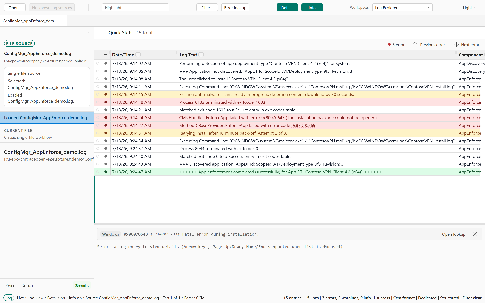
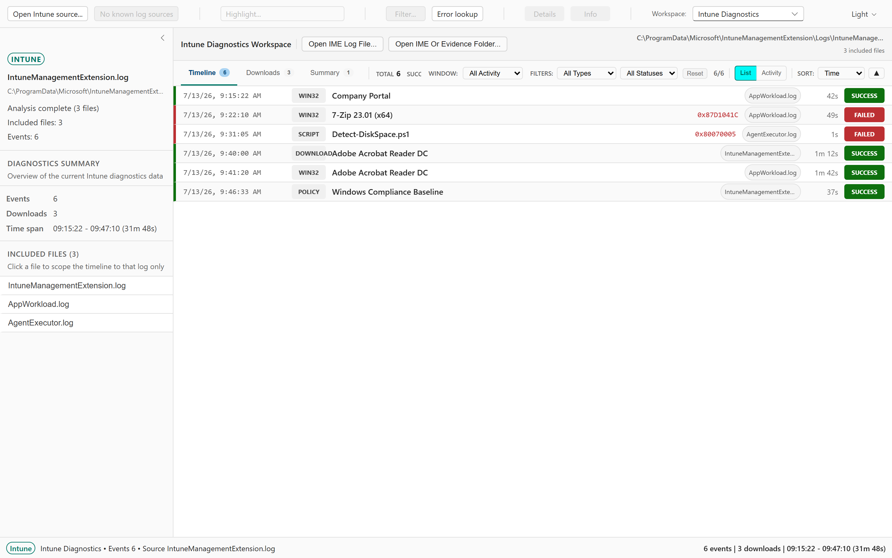
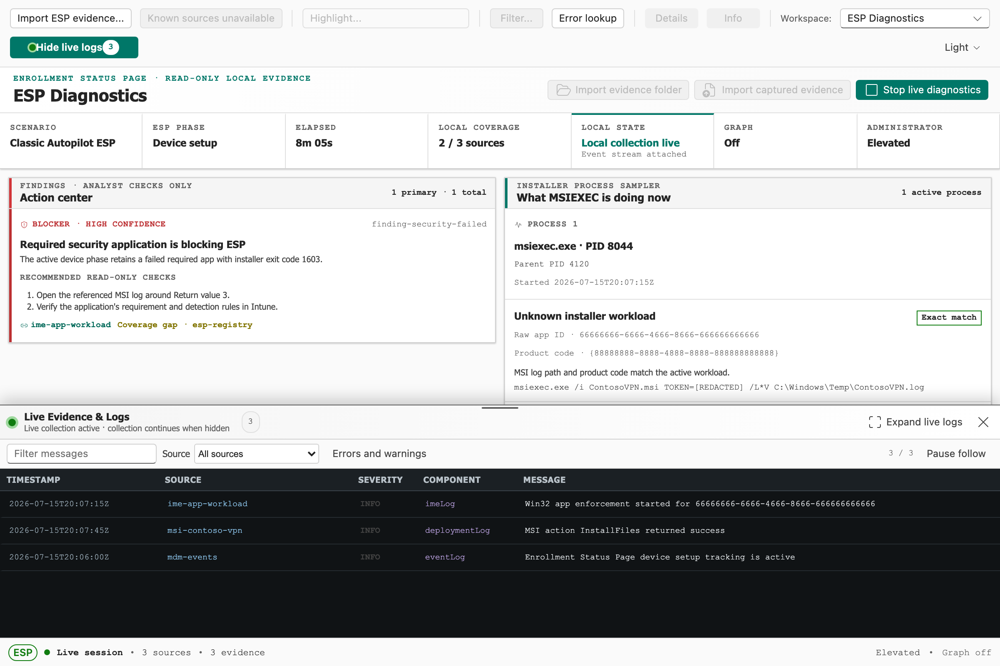
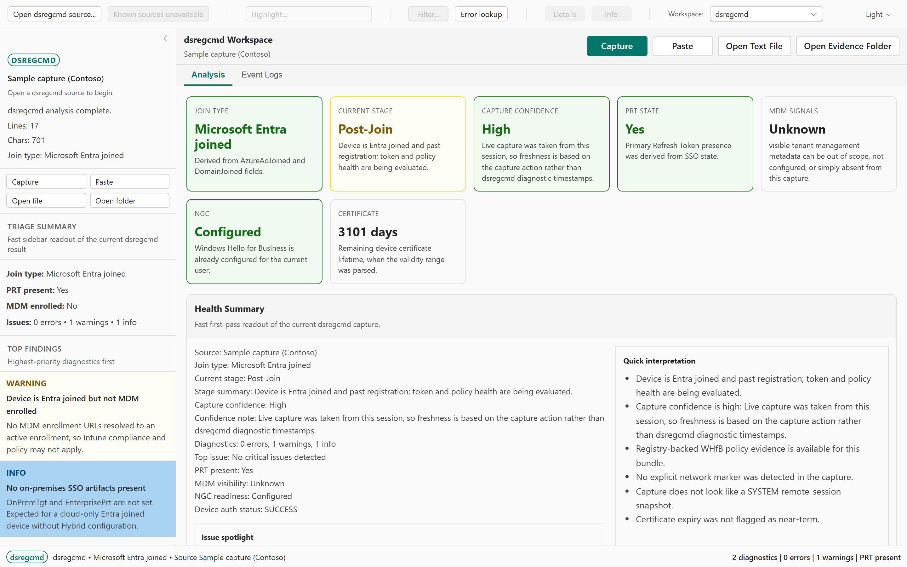

# CMTrace Open

A free, open-source log viewer and Windows troubleshooting tool. Drop in a log file and start reading — no install wizards, no prerequisites, no license keys.

Built as a modern replacement for Microsoft's CMTrace.exe with added Intune and Autopilot ESP diagnostics, DSRegCmd analysis, and real-time log tailing.

## Screenshots

### Log Viewer

Format auto-detection, severity color coding, and one-click Windows error-code lookup.



### Intune Diagnostics

A color-coded event timeline for Win32 apps, scripts, and downloads — success and failure at a glance.



### ESP Diagnostics

A single-page Autopilot and Device Preparation cockpit with actionable workload, MSIEXEC, coverage, and live-log evidence.



### DSRegCmd Troubleshooting

Device join posture, PRT and certificate health, and prioritized issue cards.



> Screenshots are generated by `npm run screenshots`. See [screenshots/README.md](screenshots/README.md).


## Install

Download the latest release for your platform and run it. That's it — single file, no dependencies.

Build status and nightly downloads are shown on the [CMTrace Open build page](https://adamgell.com/cmtraceopen/).

| Platform | Download |
|----------|----------|
| Windows (x64) | [.msi + NSIS .exe installers](https://download.cmtraceopen.com/?source=github-readme) |
| macOS (Apple Silicon) | [.dmg](https://download.cmtraceopen.com/?source=github-readme) |
| Linux (x64) | [.deb / .AppImage](https://download.cmtraceopen.com/?source=github-readme) |

All releases are signed. The Windows executable is code-signed and the macOS app is notarized.

Startup update checks are disabled by default. Users can opt in from Settings > Updates. Managed Windows deployments can force-disable all app update checks with either installer:

```powershell
CMTrace-Open_*_x64-setup.exe /S /DisableUpdateChecks
msiexec /i CMTrace-Open_<version>_x64.msi /qn DISABLEUPDATECHECKS=1
```

The MSI option writes `HKLM\Software\CMTrace Open\DisableUpdateChecks=1` and survives uninstall or upgrade until an administrator removes it. The NSIS switch writes the same value under the selected install registry hive. Existing user preferences cannot re-enable update checks on managed devices while this policy is present.

> **Note:** You do **not** need Node.js, Rust, or any development tools to run CMTrace Open. Just download and run.

## Editions: Full vs Lite

CMTrace Open ships as two standalone builds from the same source. Both are single-file executables with no installer or dependencies. The download page labels them "full edition" and "lite edition". Choose **Full** unless you specifically want the smallest possible download - it is the default build and includes everything.

### Full edition (default)

The complete tool: the log viewer plus every specialized troubleshooting feature.

| Feature | What it does | Platform |
|---------|--------------|----------|
| Intune Diagnostics | IntuneManagementExtension (IME) log analysis, event timeline, and download statistics | All |
| ESP Diagnostics | Read-only Autopilot ESP and Device Preparation triage with bounded live evidence, MSIEXEC activity, and optional Microsoft Graph enrichment | All (live acquisition: Windows) |
| DSRegCmd | Entra join, hybrid join, PRT, MDM, and Windows Hello for Business triage | Windows |
| Software Deployment | Scan a folder of app-install logs (MSI, PSADT, Burn, PatchMyPC) for exit codes and failures | Windows |
| Event Log Viewer | Open and query Windows Event Log (`.evtx`) files; enumerate live channels | All (live channels: Windows) |
| Sysmon | Sysmon operational event log analysis | Windows |
| Secure Boot Certs | Secure Boot certificate-rotation analysis and remediation | All (live scan: Windows) |
| macOS Diagnostics | Intune, Defender, configuration profile, and package diagnostics | macOS |
| Diagnostic Collection | Gather logs, registry keys, and event logs into an evidence bundle | Windows |

### Lite edition

The core log viewer only. It keeps everything under **Log Viewer** below - format auto-detection, real-time tailing, virtual scrolling, find and filter, text highlighting, and the embedded error-code database - plus the Timeline and DNS / DHCP tools. It leaves out the nine specialized features above, which also drops the Windows Event Log and property-list parsers and makes the binary noticeably smaller. Choose Lite if you just want a fast, portable, CMTrace-style log reader with a minimal footprint.

Both editions read the same log formats and share the same viewer, so a log you can open in Full opens identically in Lite.

## Features

### Log Viewer

- **Auto-detection** — automatically identifies CCM, CBS, DISM, Panther, simple, and plain text log formats
- **Real-time tailing** — live file watching with pause/resume
- **Virtual scrolling** — smooth performance with 100K+ line files
- **Severity color coding** — Errors (red), Warnings (yellow), Info (default)
- **Find and Filter** — Ctrl+F search with F3 navigation; filter by message, component, thread, or timestamp
- **Text highlighting** — configurable keyword highlighting
- **Error code lookup** — 120+ embedded Windows, SCCM, and Intune error codes
- **Flexible input** — open files, folders, drag and drop, or use built-in source presets
- **File association** — set as default `.log` file handler on Windows

### Intune Diagnostics Workspace

Analyze Intune Management Extension logs without reading raw text line by line.

- Parse a single IME log or an entire `IntuneManagementExtension\Logs` folder
- Color-coded event timeline for Win32 apps, WinGet apps, PowerShell scripts, remediations, ESP, and sync sessions
- Download statistics with size, speed, and Delivery Optimization percentage
- Summary dashboard with event counts, success/failure rates, and log time span
- Automatic GUID extraction for app and policy identifiers
- Issue clustering with suggested next steps

### ESP Diagnostics Workspace

Troubleshoot Windows Autopilot Enrollment Status Page (ESP), Autopilot Device Preparation, and software-install failures in one read-only workspace. Live collection runs on Windows; captured CMTrace Open evidence folders, `manifest.json`, CAB, and ZIP inputs can be analyzed on every supported desktop platform.

- Single full-width cockpit with no left sidebar: current phase, findings, workload status, enrollment evidence, Delivery Optimization, coverage, and **What MSIEXEC is doing now** stay visible together
- Classic ESP and Device Preparation are classified separately, including the applicable profile, enrollment, app, script, policy, certificate, Office, NodeCache, hardware, and event evidence from the PowerShell v6.3 diagnostic contract
- Every device and user enrollment session is retained; the latest session is identified chronologically, and a session selector can isolate any earlier attempt without collapsing retries
- Running as administrator is recommended as soon as a non-elevated Windows process enters the workspace because protected registry, event-log, process-command-line, SYSTEM-temp, and user-temp evidence materially improves coverage; non-elevated analysis still works and reports each unavailable source explicitly
- Live deployment logs are discovered only from curated IME/deployment roots and shallow, high-signal temporary locations; there is no deep scan or full-drive search
- **Open live logs** keeps collecting while collapsed, opens a vertically resizable dock, and can expand the logs to the full workspace with a clear restore action
- MSIEXEC sampling covers zero, one, or multiple processes and labels exact, parent-chain, identifier, temporal, or ambiguous correlation instead of guessing
- Local evidence and raw identifiers are always shown. The existing opt-in Windows WAM connection can add Intune names, assignments, Autopilot/ESP configuration, and device status without replacing local provenance. ESP startup and refresh never open WAM; Settings can explicitly open it to sign in or, for an authenticated partial connection, to request the fixed remaining declared read permissions
- Graph sections fail independently and label beta endpoints. Disabled, disconnected, denied, offline, throttled, partial, and cancelled Graph states never erase local logs or conclusions
- Graph requests are limited to the existing delegated read scopes `DeviceManagementManagedDevices.Read.All`, `DeviceManagementServiceConfig.Read.All`, `DeviceManagementApps.Read.All`, `DeviceManagementConfiguration.Read.All`, and `DeviceManagementScripts.Read.All`; no write or group-membership permission is requested
- Findings recommend read-only checks; the workspace does not install or retry applications, sync MDM, start or stop services, change registry values, run remediation, or modify Intune
- Missing, permission-denied, malformed, unsupported, and retention-limited sources remain explicit coverage gaps. A gap means the conclusion is incomplete, not that the device or workload is healthy
- Sensitive UPN, SID, tenant, EntDMID, serial, and NodeCache fields are masked by default, command lines are sanitized, access tokens remain memory-only, and raw hardware hashes are excluded from normal UI, logs, screenshots, copy, and export

### DSRegCmd Troubleshooting Workspace

Triage Entra join, hybrid join, PRT, MDM, and Windows Hello for Business issues.

- Live capture, paste, text file, or evidence bundle input
- Join posture, failure stage, and capture confidence at a glance
- Issue cards with severity, evidence, and suggested fixes
- Registry-backed Windows Hello for Business policy correlation
- Export as JSON or summary for case handoff

See the [DSRegCmd troubleshooting guide](DSREGCMD_TROUBLESHOOTING.md) for a detailed walkthrough.

## Quick Start

1. **Download** the release for your platform from the [CMTrace Open download page](https://download.cmtraceopen.com/?source=github-readme)
2. **Run** the executable — no install required (or use the Windows MSI/NSIS installer)
3. **Open a log** — drag and drop a file, use File > Open, or use a source preset
4. **Explore** — use Find (Ctrl+F), Filter, or switch to the Intune/DSRegCmd workspace

## Supported Log Formats

| Format | Examples |
|--------|----------|
| CCM | `<![LOG[...]LOG]!>` — ConfigMgr client logs |
| CBS / DISM / Panther | `CBS.log`, `dism.log`, `setupact.log`, `setuperr.log` |
| Simple | `$$<` delimited — older SCCM-style logs |
| Plain text | Any `.log` or `.txt` file with or without timestamps |

Format detection is automatic. Open any log file and CMTrace Open will pick the right parser.

## Documentation

Visit the [CMTrace Open Wiki](https://github.com/adamgell/CMTraceOpen/wiki) for detailed guides:

- [Getting Started](https://github.com/adamgell/CMTraceOpen/wiki/Getting-Started) — installation, first log, basic navigation
- [Log Viewer Guide](https://github.com/adamgell/CMTraceOpen/wiki/Log-Viewer) — find, filter, highlight, tailing
- [Intune Workspace](https://github.com/adamgell/CMTraceOpen/wiki/Intune-Workspace) — IME log analysis and diagnostics
- [DSRegCmd Workspace](https://github.com/adamgell/CMTraceOpen/wiki/DSRegCmd-Workspace) — device join and identity troubleshooting
- [FAQ](https://github.com/adamgell/CMTraceOpen/wiki/FAQ) — common questions and answers

## Contributing

CMTrace Open welcomes contributions. See [CONTRIBUTING.md](CONTRIBUTING.md) for development setup, build commands, architecture overview, and coding guidelines.

## Disclaimer

CMTrace is a tool developed and distributed by Microsoft Corporation. CMTrace Open is an independent open-source project and is **not** affiliated with, endorsed by, or connected with Microsoft Corporation. See [DISCLAIMER.md](DISCLAIMER.md) for full details.

## License

[MIT](LICENSE)
